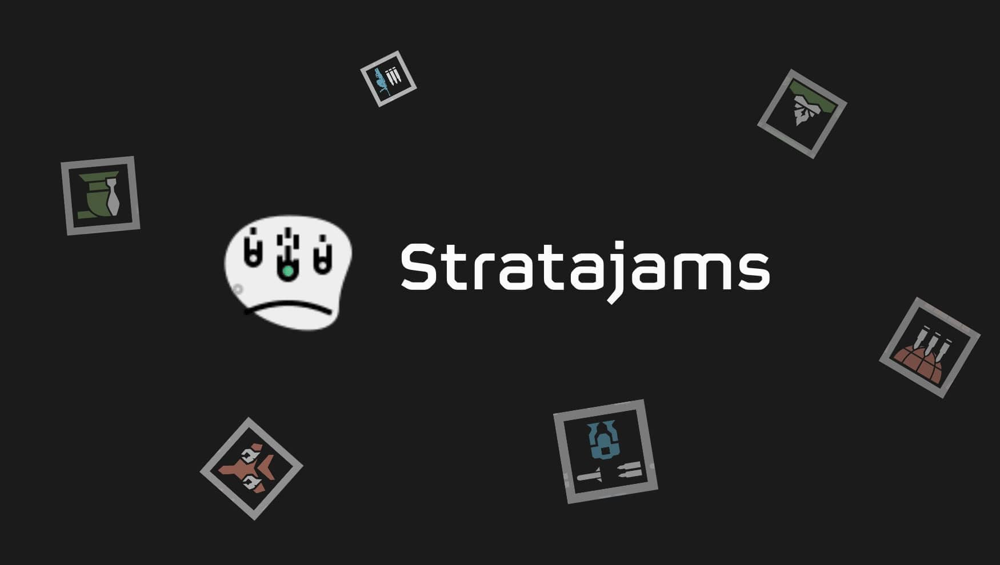

</img>

<h1 align="center"> Stratajams </h1>

  <a href="#💡-purpose">Purpose</a> •
  <a href="#⚙️-functionality">Functionality</a> •
  <a href="#-special-thanks">Special Thanks</a> •

## 💡 Purpose

This project was developed as part of a 1 week hackathon at Coder Academy, where the aim was to create a ReactJS app showcasing various skills, including asynchronous JavaScript, React, state management (using hooks, reducer, and global state), local storage, and React routing.

## ⚙️ Functionality

1. **Interactive Key Sequence Matching**
    
    This feature displays a random stratagem with a sequence of directional arrow keys. Users must press the corresponding arrow keys (up, down, left, right) in the correct order. Correct keypresses are visually indicated and accompanied by a sound effect.

2. **Performance Monitor**

    This feature starts a timer that countsdown from 60. It tracks and displays performance stats, including:
    
    - Accurary (ACC): The percentage of correct keypresses out of the total keypresses.
    - Deployment per Minute (DPM): The number of successfully deployed stratagems per minute.
    

3. **Hotkeys**

    This feature provides an alternative to mouse input for "DEPLOY" and "MONITOR" buttons. 

    - Spacebar: Deploys the current stratagem if all keys are matched, and loads the next one.
    - "M" Key: Initiates a 60-second monitoring session, starting the timer and resetting performance metrics.

    

## 🤗 Special Thanks

Many thanks to everyone who contributed to the HellHub Collective's API, which enabled me to effortlessly retrieve Helldivers 2 data.